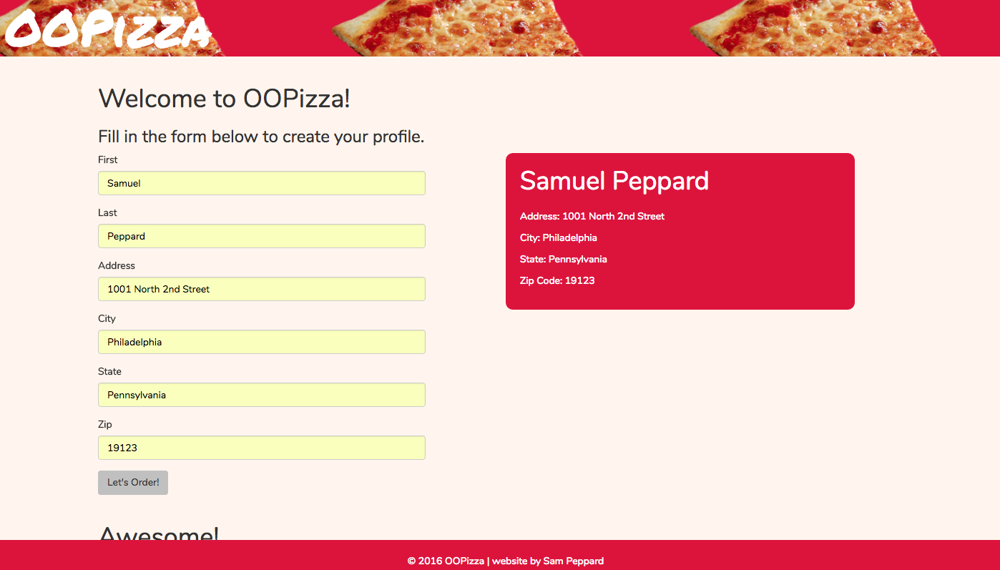

# **OOPizza**

##### A project built using Object-Oriented Javascript. 8.30.2016
#
##### By [Sam Peppard](https://github.com/sampeppard)
#

----
### **Description**

A three step pizza order form that allows a user to create a profile, place multiple different pizza orders, and see the details of each order when clicked.

----
### **Specifications**
| _Behavior_ | _Input_ | _Output_ |
|:---------------------------------------------------------------------:|:---------------------------------------------------------------------------:|:-------------------------------------------------------------------------------------------------------------------:|
| Return user profile information after user creates profile, also reveal pizza order form
 | Bob Smith, 123 Fake Street, Springfield NY, 12345 | Bob Smith, Address: 123 Fake Street, City: Springfield  State: NY, Zip Code: 12345 |
| Return order listed with ID number after user enters enters order info | Delivery, Large, Pepperoni | Order 1 |
| Return any other orders the user creates in the list of orders | Pickup, Medium, Peppers | Order 2 |
| Return order info based on which listed order number user clicks | Order 1 clicke | Pickup/Deliver: Pickup, Size: large, Final Price: $14.00 |
----

### **Setup/Installation Requirements**

* Clone this repository
* If editing, open project directory in Code Editor of choice
* If viewing, open index.html in a web browser

----

### **Known Bugs**

No known bugs.

----
### **Support and contact details**

For comments or questions, please email sampeppard@gmail.com

----
### **Technologies Used**

* HTML
* CSS3
* Bootstrap version 3.3.7
* JavaScript
* jQuery version 3.1.0

----
### Link to project on Github Pages

https://sampeppard.github.io/OOPizza/

----
### License

*This application is licensed under the MIT license*

Copyright (c) 2016 **Samuel Peppard**
